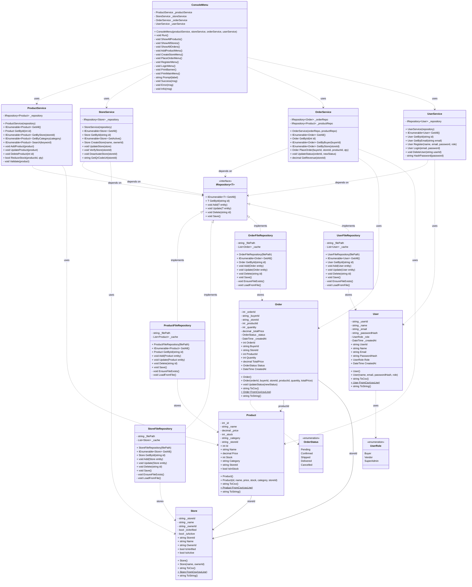

# Class Diagram — ShopPlatform

## UML Class Diagram (Mermaid)

---

## Class Descriptions

### Models Layer

| Class | Responsibility | Key Attributes |
|---|---|---|
| `Product` | Represents a store product | `_id`, `_name`, `_price`, `_stock`, `_category`, `_storeId` |
| `Store` | Represents a vendor store | `_storeId`, `_name`, `_ownerId`, `_isVerified`, `_isActive` |
| `Order` | Represents a purchase order | `_orderId`, `_buyerId`, `_productId`, `_quantity`, `_totalPrice`, `_status` |
| `User` | Represents a platform user | `_userId`, `_name`, `_email`, `_passwordHash`, `_role` |
| `OrderStatus` | Enum for order lifecycle | `Pending → Confirmed → Shipped → Delivered / Cancelled` |
| `UserRole` | Enum for access control | `Buyer`, `Vendor`, `SuperAdmin` |

### Data Layer

| Class | Responsibility |
|---|---|
| `IRepository<T>` | Interface contract for all data operations |
| `ProductFileRepository` | CSV-based CRUD for Product entities |
| `StoreFileRepository` | CSV-based CRUD for Store entities |
| `OrderFileRepository` | CSV-based CRUD for Order entities |
| `UserFileRepository` | CSV-based CRUD for User entities |

### Services Layer

| Class | Responsibility |
|---|---|
| `ProductService` | Product business logic (add, update, search, stock management) |
| `StoreService` | Store management (create, verify, deactivate, QR generation) |
| `OrderService` | Order placement, status tracking, revenue calculation |
| `UserService` | User registration, authentication (SHA-256 hashing) |

### UI Layer

| Class | Responsibility |
|---|---|
| `ConsoleMenu` | All console I/O — menus, prompts, display, formatting |
